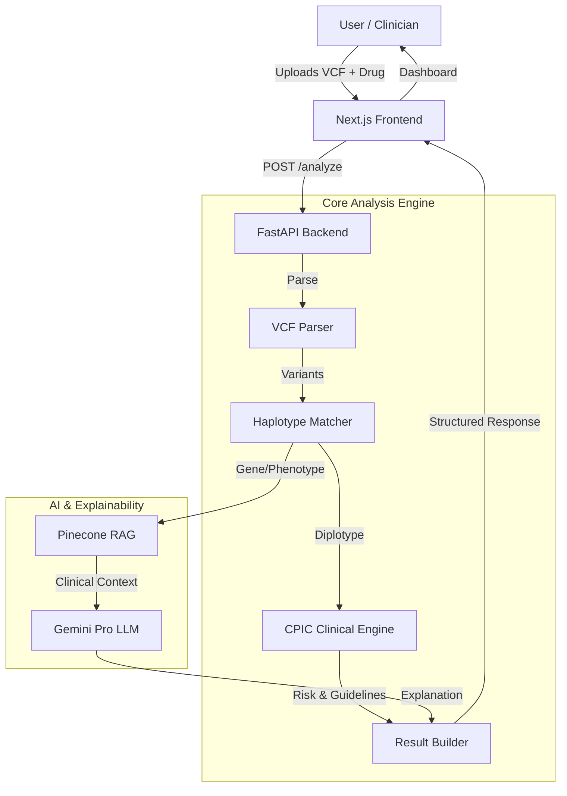

# PharmaGuard 🧬💊
> **Preventing Adverse Drug Reactions with AI-Powered Pharmacogenomics**

[](https://opensource.org/licenses/MIT)
[](https://nextjs.org/)
[](https://deepmind.google/technologies/gemini/)

## 🚀 Live Demo & Video
- **Live App:** [[https://pharmaguard-demo.vercel.app](https://pharmaguard-demo.vercel.app)](https://pharmaguard-udj2.vercel.app/) *(Replace with actual link)*
- **Demo Video:** [[LinkedIn / YouTube Link Here]](https://www.linkedin.com/posts/sudeepshm_rift2026-pharmaguard-pharmacogenomics-ugcPost-7430407699000983552-K83N?utm_source=share&utm_medium=member_android&rcm=ACoAAFQ9qhoBtMsVln-CniMk0uFUKGr30_zmGVk)(https://linkedin.com) *(Replace with actual link)*
team name:runvia
TEAM MEMEBERS:SUDEEP H M
SIDDARTHA r s
shreyas P R


---

## 🧐 The Problem
**100,000 Americans die annually from adverse drug reactions (ADRs)**, making it the 4th leading cause of death in hospitals. Many of these are preventable. Standard dosing is "one size fits all," but genetic variations in enzymes like **CYP2D6** and **DPYD** can turn a standard dose into a lethal overdose or render it completely ineffective.

## 💡 The Solution
**PharmaGuard** is a clinical decision support system that:
1.  **Parses raw patient genetic data (VCF)** to detect specific variants.
2.  **assigns star-allele diplotypes** (e.g., `*1/*4`) and phenotypes (e.g., "Poor Metabolizer").
3.  **Matches against CPIC guidelines** to predict risk: *Safe, Adjust Dosage, Toxic, or Ineffective*.
4.  **Generates plain-language explanations** using **Google Gemini** and RAG (Retrieval-Augmented Generation).

---

## 🏗️ Architecture



---

## 🛠️ Tech Stack

| Component | Technology | Purpose |
|-----------|------------|---------|
| **Frontend** | Next.js 14, Tailwind CSS, Shadcn UI | Responsive clinical dashboard |
| **Backend** | Python, FastAPI | High-performance API & logic |
| **Genomics** | PyVCF3, Custom Haplotype Caller | parsing & diplotype assignment |
| **AI / LLM** | **Google Gemini Pro** | Clinical explanation generation |
| **Vector DB** | Pinecone | RAG for clinical literature |
| **Data** | CPIC Database | Guideline source (JSON) |

---

## ⚡ Features

- **📂 Universal VCF Support**: Accepts standard VCF v4.2 files.
- **🧬 6 Pharmacogenes**: Covers CYP2D6, CYP2C19, CYP2C9, SLCO1B1, TPMT, DPYD.
- **🛡️ CPIC Alignment**: Strict adherence to CPIC Level A guidelines.
- **⚠️ Risk Traffic Lights**: Instant visual cues (Green/Yellow/Red).
- **📝 Auditable Explanations**: AI explains *why* a risk exists (mechanism of action).
- **🔒 Privacy First**: All processing happens in-memory; no storage of VCFs.

---

## 📦 Installation

### Prerequisites
- Python 3.9+
- Node.js 18+
- Google Gemini API Key

### 1. Clone Repository
```bash
git clone https://github.com/sudeepshm/pharmaguard.git
cd pharmaguard
```

### 2. Backend Setup
```bash
cd backend01
python -m venv venv
# Windows
.\venv\Scripts\activate
# Mac/Linux
source venv/bin/activate

pip install -r requirements.txt
```

**Configure Environment:**
Create a `.env` file in `backend01/`:
```env
GEMINI_API_KEY=your_gemini_key_here
PINECONE_API_KEY=your_pinecone_key_here
PINECONE_ENV=gcp-starter
```

**Run Server:**
```bash
uvicorn app.main:app --reload --port 8000
```

### 3. Frontend Setup
```bash
cd ../frontend01
npm install
```

**Configure Environment:**
Create a `.env.local` file in `frontend01/`:
```env
NEXT_PUBLIC_API_URL=http://localhost:8000
```

**Run Client:**
```bash
npm run dev
```
Visit `http://localhost:3000`

---

## 🔌 API Documentation

### `POST /api/analyze`
Analyzes a VCF file against a list of drugs.

**Request:** `multipart/form-data`
- `file`: .vcf file
- `drugs`: comma-separated string (e.g., "codeine,warfarin")

**Response:**
```json
{
  "status": "success",
  "results": [
    {
      "drug": "CODEINE",
      "risk_assessment": {
        "risk_label": "Adjust Dosage",
        "severity": "moderate"
      },
      "pharmacogenomic_profile": {
        "primary_gene": "CYP2D6",
        "diplotype": "*1/*4",
        "phenotype": "IM"
      },
      "clinical_recommendation": {
        "recommendation": "Use codeine with caution at reduced dose..."
      }
    }
  ]
}
```

---

## 👥 Team
- **Sudeep SHM** - Full Stack Developer & AI Engineer
- *[Add other team members]*

---
*Built for RIFT 2026 Hackathon - HealthTech Track*
